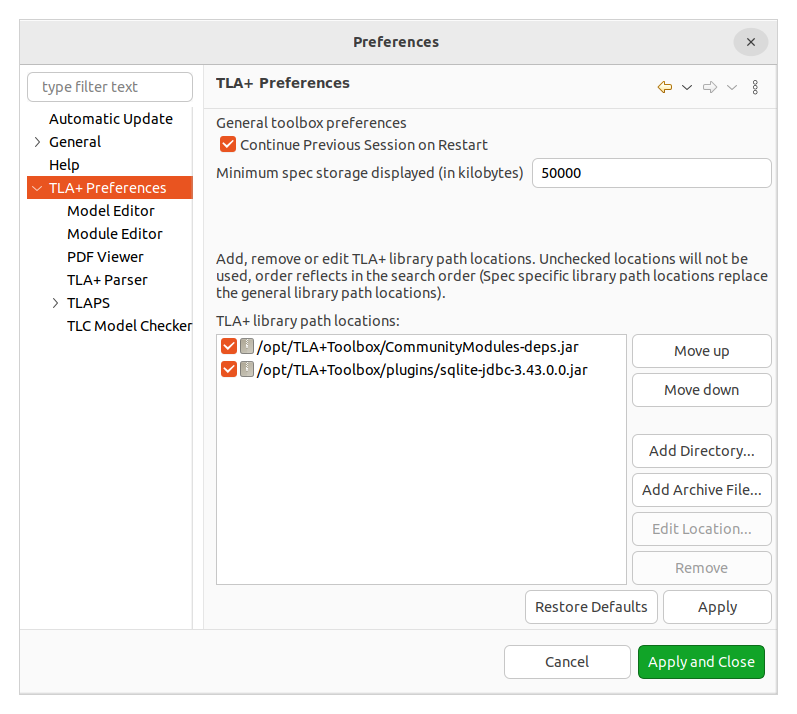

# Usage

This repo depends some modules(likes [GenID](https://github.com/scuptio/TLAPlusCommunityModules/blob/master/modules/GenID.tla)) which overide operators.

Setup by the following steps:

1. Download [CommunityModules-dep.jar](https://github.com/scuptio/TLAPlusCommunityModules/releases)

2. In tla+ toolbox, 

    File -> Preferences -> TLA+ Preference

    Specify TLA+ library path option locations

